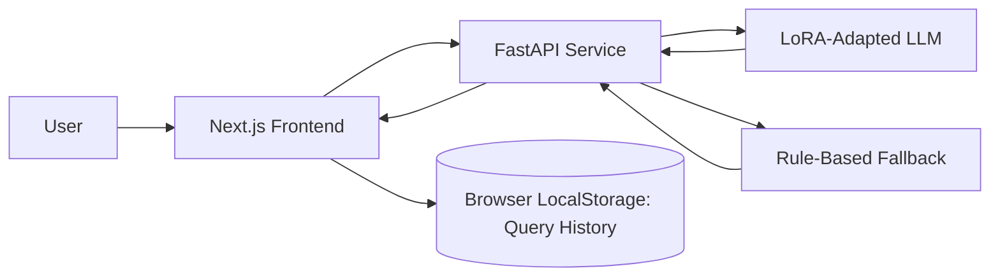
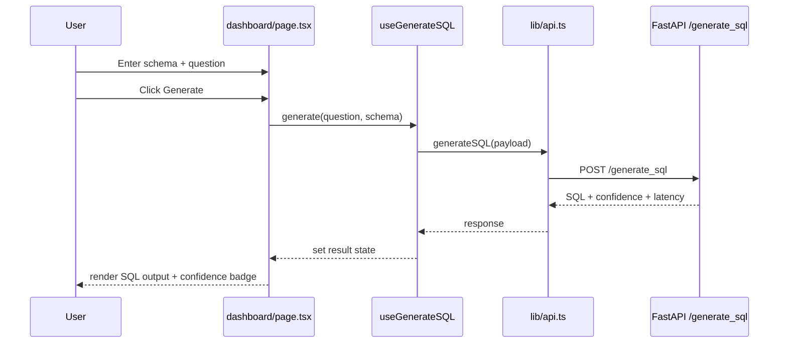

# Text-to-SQL Interview Playbook

This document is designed to help you present this project confidently in interviews (SWE/ML/Full-stack/Product-facing roles).

---

## 1) Project in One Line

Built an end-to-end Text-to-SQL platform that fine-tunes a lightweight LLM with LoRA and serves SQL generation through a FastAPI backend and a Next.js frontend, including confidence scoring and fallback inference.

---

## 2) 30-Second, 2-Minute, and 5-Minute Pitch

## 30-Second Pitch

I built a full Text-to-SQL system where users paste a schema and ask natural language questions. The backend runs a LoRA-fine-tuned TinyLlama model to generate SQL and returns confidence plus latency. The frontend provides an interactive dashboard with schema editor, query history, health checks, and SQL output UX. If the model is unavailable, the API gracefully degrades to a rule-based fallback so the app still works.

## 2-Minute Pitch

The system has three layers:
- ML pipeline for training/evaluation (`scripts/train_spider.py`, `scripts/eval.py`, `data/pipeline.py`)
- Inference API (`api/serve.py`)
- Product UI (`frontend/app/dashboard/page.tsx`)

For training, I use Spider CSV examples with instruction-style prompts and LoRA on TinyLlama, which keeps trainable params tiny while preserving quality.  
For serving, FastAPI exposes `/generate_sql` and `/health`; model output includes confidence from token probabilities and latency.  
On the UI side, users input schema + question, trigger generation, and view SQL with confidence badges. I also store query history in localStorage for practical usability.  
The architecture is built to run locally with one command and can evolve into production by adding proper execution sandboxing, observability, and scalable serving.

## 5-Minute Pitch (Interview Deep Dive)

1. **Problem**: writing SQL manually is slow/error-prone, especially for non-SQL users.
2. **Approach**: convert NL to SQL using supervised fine-tuning + LoRA.
3. **Why LoRA**: lower memory/cost, faster experimentation, small adapter artifact.
4. **Backend design**:
   - strict input validation
   - deterministic API contract
   - confidence + latency surfaced to UI
   - fallback mode when model is offline
5. **Frontend design**:
   - clean flow: schema -> question -> SQL
   - status + toasts + history for UX reliability
6. **Results and operational posture**:
   - build and route health verified
   - confidence scoring implemented
   - clear next steps for production hardening

---

## 3) HLD (High-Level Design)



### HLD Components

- **Frontend (Next.js App Router)**
  - Landing: `frontend/app/page.tsx`
  - Dashboard: `frontend/app/dashboard/page.tsx`
  - Chat demo: `frontend/app/chat/page.tsx`
- **API Layer**
  - `api/serve.py`
  - Endpoints: `GET /health`, `POST /generate_sql`
- **ML Layer**
  - Training: `scripts/train_spider.py`
  - Data prep: `data/pipeline.py`
  - Inference engine: `inference/engine.py`
  - Eval: `evaluation/evaluator.py`
- **Persistence**
  - Client-side history in browser storage (`useQueryHistory`)
  - Model artifacts in `outputs/spider/final_model`

---

## 4) LLD (Low-Level Design)

## 4.1 Backend LLD

### Core file
- `api/serve.py`

### Request lifecycle (`POST /generate_sql`)
1. Validate `question` and `schema`
2. Ensure meaningful question text
3. Choose inference path:
   - **Model loaded** -> `generate_sql(...)`
   - **Model missing** -> `_generate_smart_sql(...)`
4. Return:
   - `generated_sql`
   - `confidence`
   - `latency_ms`

### Important backend internals
- `_parse_schema(schema)`: extracts table/column hints
- `_mock_confidence(...)`: heuristic confidence for fallback mode
- `generate_sql(...)`: prompt assembly + token generation + confidence from scores
- `lifespan(...)`: loads model/tokenizer when `--adapter_path` is provided

### API contract
- Request:
```json
{ "question": "How many employees?", "schema": "CREATE TABLE employees (...);" }
```
- Response:
```json
{ "generated_sql": "SELECT COUNT(*) FROM employees;", "confidence": 0.83, "latency_ms": 142.1 }
```

---

## 4.2 Frontend LLD

### Main files
- `frontend/app/layout.tsx`
- `frontend/app/dashboard/page.tsx`
- `frontend/hooks/useGenerateSQL.ts`
- `frontend/hooks/useBackendStatus.ts`
- `frontend/hooks/useQueryHistory.ts`
- `frontend/lib/api.ts`
- `frontend/components/SQLOutput.tsx`

### Dashboard state flow



### UX reliability mechanics
- Toast notifications for validation/success/errors
- Backend online/offline indicator
- Query history with add/remove/clear and max size cap
- Copy-to-clipboard for generated SQL

---

## 4.3 ML Pipeline LLD

### Data pipeline
- File: `data/pipeline.py`
- Active training path: `SpiderCSVPipeline`
  - Reads `text_query` and `sql_command`
  - Produces `[INST] ... [/INST]` prompt + target SQL
  - Splits train/val/test

### Training flow
- Script: `scripts/train_spider.py`
- Steps:
  1. Load `configs/config_spider.yaml`
  2. Build train/val/test datasets
  3. Load base model + tokenizer
  4. Attach LoRA adapters
  5. Train with `trl.SFTTrainer`
  6. Save adapter + tokenizer to `outputs/spider/final_model`

### Evaluation flow
- Script: `scripts/eval.py`
- Metric harness: `evaluation/evaluator.py`
  - exact match
  - category breakdown (`simple`, `filter`, `aggregation`)
  - optional execution-accuracy-style checks

---

## 5) End-to-End Workflow You Should Demonstrate

## Setup

```bash
./run.sh
```

or manual:

```bash
python api/serve.py --adapter_path outputs/spider/final_model
cd frontend && NEXT_PUBLIC_API_URL=http://localhost:8000 npx next dev -p 3000
```

## Demo Script (7-10 min)

1. Open landing page (`/`) and explain problem + value.
2. Go to dashboard (`/dashboard`).
3. Paste sample schema.
4. Ask an NL query (e.g., "show total salary by department").
5. Click generate and explain:
   - request goes to `/generate_sql`
   - model generates SQL
   - confidence and latency returned
6. Show:
   - copy SQL
   - query history
   - backend health indicator behavior
7. Mention fallback behavior if model not loaded.
8. Optional: show `/chat` as UI experiment path.

---

## 6) Interview Talking Points (Design Decisions)

- **LoRA over full fine-tuning**:
  - lower memory and faster iteration
  - tiny adapter artifact
- **Confidence scoring exposed to UI**:
  - helps users decide trust level
- **Fallback strategy**:
  - system remains usable even if model init fails
- **Frontend decomposition**:
  - hooks isolate API/data concerns from rendering components
- **Operational simplicity**:
  - one-command local bootstrap with `run.sh`

---

## 7) Trade-offs and Limitations (Speak Honestly)

1. Spider CSV training path currently does not embed rich schema context in training prompts.
2. `execution_result` is part of response schema but not populated in backend flow today.
3. Chat route (`/chat`) is currently UI-focused and not wired to backend generation.
4. Fallback SQL heuristics are useful for resilience but not equivalent to model quality.
5. No full production deployment stack yet (auth, rate limits, observability, sandboxed SQL exec).

---

## 8) Suggested Production Roadmap

## Phase 1 (1-2 weeks)
- Connect `/chat` to backend generation endpoint
- Add structured request logging and latency percentiles
- Add automated backend tests for `/generate_sql` validation and response contract

## Phase 2 (2-4 weeks)
- Add execution sandbox (safe SQL runtime, strict limits)
- Improve schema parsing and prompt template quality
- Add experiment tracking + model version metadata in responses

## Phase 3 (4-8 weeks)
- Move to scalable inference serving (vLLM/TGI option)
- Add auth + per-user quotas
- Add CI/CD with smoke tests and monitored deployment

---

## 9) Interview Q&A Bank (Likely Questions + Strong Answers)

## Q1) Why this architecture?
- It separates concerns clearly: model training, API inference, and product UI can evolve independently.

## Q2) How do you ensure reliability?
- Input validation, health checks, and fallback inference prevent full outage for users.

## Q3) How do you measure quality?
- Exact match and category breakdown from evaluator; confidence and latency from inference path.

## Q4) How would you scale?
- Stateless API replicas, model server separation, async queueing for heavy requests, and metrics-driven autoscaling.

## Q5) Biggest technical challenge?
- Balancing model quality with local hardware constraints; LoRA enabled fast iterative development.

---

## 10) Resume-Ready Bullets

- Architected and delivered an end-to-end Text-to-SQL platform (LoRA fine-tuning + FastAPI inference + Next.js product UI) from training to live generation.
- Implemented confidence-scored SQL generation with robust fallback mode and surfaced model reliability metrics (confidence/latency) in the user interface.
- Built modular frontend workflow (schema editor, query input/output, health status, persistent history) and API integration for production-style user experience.
- Designed extensible training/evaluation pipeline on Spider dataset with configurable LoRA/SFT setup and reproducible script-driven workflow.

---

## 11) What To Show If Asked For Code Walkthrough

Start here in this order:
1. `frontend/app/dashboard/page.tsx` (user journey + orchestration)
2. `frontend/hooks/useGenerateSQL.ts` and `frontend/lib/api.ts` (network path)
3. `api/serve.py` (API contract + model/fallback logic)
4. `scripts/train_spider.py` + `data/pipeline.py` (training story)
5. `evaluation/evaluator.py` (quality measurement story)

This sequence maps directly to product behavior and interviewer expectations.

